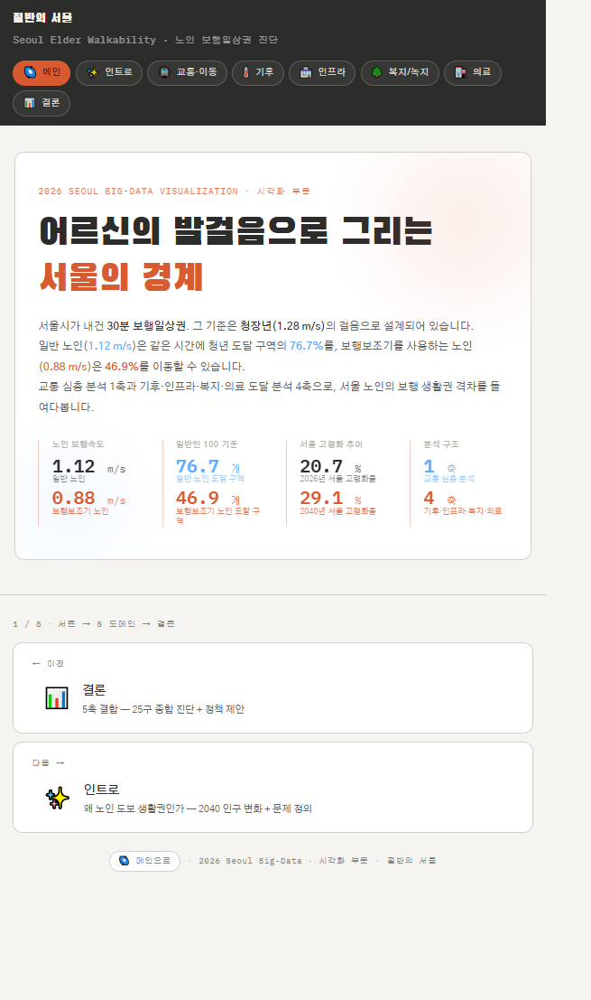
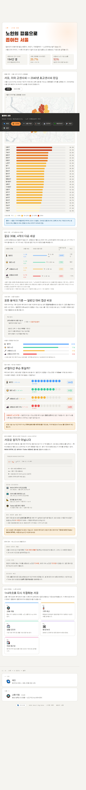
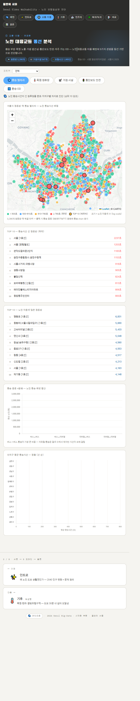
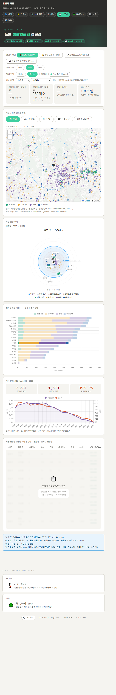
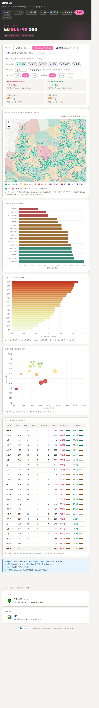

# 절반의 서울 — 어르신의 발걸음이 그리는 서울의 경계

> **2026 서울 빅데이터 활용 경진대회 시각화부문 · 우수상(3위) 수상작** 🏆
>
> 🌐 **인터랙티브 대시보드 → [seniorwalkseoul.site](https://seniorwalkseoul.site)**

> **같은 30분, 4개의 다른 세상.**

서울시 2040 도시기본계획은 7대 목표의 하나로 **"30분 도보 생활권"** 을 약속한다. 그러나 그 30분은 보행 속도 **1.28 m/s**(성인 표준)를 기준으로 설계되어 있다. 건강한 노인은 **1.12 m/s**, 보행보조기 노인은 **0.88 m/s**, 하위 15% 노인은 **0.70 m/s** 로 걷는다. 같은 30분이라도 도달할 수 있는 세상의 크기가 달라진다.

> 일반인이 30분이면 닿는 생활인프라 246개소 중 **86개소(35%)** 가 보행보조 노인에게는 닿지 않는다.

이 프로젝트는 **이미 고령사회에 진입한 서울**(2026년 고령화율 20.7% → 2040년 28.8% 전망)을 **25개 자치구 · 427개 행정동** 단위에서 **1+4축**으로 다시 측정한다. _보이지 않던 격차를, 보이게 만드는 일._



---

## 분석 프레임 — 1+4축

`1축`(노인 대중교통 동선)으로 이동의 실태를 짚고, `4축`(기후안전·생활인프라·복지/녹지·의료)에서 자치구·행정동별 **도달가능 점수**를 산출한다.

| 축    | 도메인                                                     | 담당   | 산출물 폴더                                              |
| ----- | ---------------------------------------------------------- | ------ | -------------------------------------------------------- |
| 1축   | **대중교통 (Transit)** — 노인 교통 이용 패턴·이동 네트워크 | 유호준 | [`team-outputs/outputs-YOO`](team-outputs/outputs-YOO)   |
| 4축 ① | **기후안전 (Climate)** — 폭염·한파 쉼터 및 결빙위험구역    | 김성령 | [`team-outputs/outputs-KIM`](team-outputs/outputs-KIM)   |
| 4축 ② | **생활인프라 (Infra)** — 전통시장·은행·생활편의 접근성     | 심재현 | [`team-outputs/outputs-SHIM`](team-outputs/outputs-SHIM) |
| 4축 ③ | **복지·녹지 (Bokji)** — 경로당·노인복지관·공원 접근성      | 양석준 | [`team-outputs/outputs-YANG`](team-outputs/outputs-YANG) |
| 4축 ④ | **의료 (Medical)** — 병의원·약국 1차 의료 접근성           | 이정태 | [`team-outputs/outputs-LEE`](team-outputs/outputs-LEE)   |

---

## 방법론 — OSM 기반 도달가능 점수

- **도보 네트워크**: OpenStreetMap 서울 보행 네트워크 위 Dijkstra 최단경로 + Convex Hull 등시선
- **보행 속도 4단계**: 동일한 30분이 그리는 도보권 면적의 차이

  | 보행 유형         | 속도     | 30분 도보권 |
  | ----------------- | -------- | ----------- |
  | 일반인            | 1.28 m/s | 11.01 km²   |
  | 일반 노인         | 1.12 m/s | 8.43 km²    |
  | 보행보조기 노인   | 0.88 m/s | 4.99 km²    |
  | 보행보조 하위 15% | 0.70 m/s | —           |

- **도달가능 점수**: 각 행정동 중심에서 30분 내 도달 가능한 시설 수를 정규화 (Tobler 경사 보정 옵션)
- **보행속도 근거**: 한음 외(2020), 「노인보호구역 보행자녹색시간 산정을 위한 보행속도 기준 개선」, 한국ITS학회논문지 19(4) — 횡단보도 보행자 4,857명 실측

---

## 주요 발견

|       | 발견              | 내용                                                                                              |
| ----- | ----------------- | ------------------------------------------------------------------------------------------------- |
| **1** | **종합 격차**     | 최고 **금천구 80.6점** ↔ 최저 **강남구 73.5점**, 격차 **7.1점**                                   |
| **2** | **보행보조 절벽** | 일반 노인 평균 **77점** → 보행보조 노인 **47점**. 단 0.24 m/s 차이가 도달 노드 수의 절반을 잘라냄 |
| **3** | **도메인 비대칭** | 같은 자치구라도 도메인별 점수는 비대칭 — 종합 점수에 가려진 '약한 축'이 정책의 진짜 진입점        |

**서울 평균 종합 점수(4축, 일반 노인 기준): 76.7점** — 보행 유형별로는 일반인 100 / 일반 노인 76.7 / 보행보조 46.9 / 하위 15% 29.6점.

**정책 제언**: 4개 도메인 각각의 하위 3개 자치구에 우선 투입 — _같은 예산이면 어디부터?_ 기후(동대문·종로·동작), 인프라(성동·관악·종로), 복지/녹지(강남·성북·마포), 의료(종로·동작·관악).

---

## 대시보드 미리보기

|                                                                       |                                                                    |
| --------------------------------------------------------------------- | ------------------------------------------------------------------ |
| **소개 · 방법론**                                                     | **대중교통 동선**                                                  |
|             |          |
| **기후안전권**                                                        | **생활인프라**                                                     |
|     |  |
| **복지·녹지**                                                         | **병의원·약국**                                                    |
|       |  |
| **결론·정책 제언**                                                    |                                                                    |
|  |                                                                    |

---

## 기술 스택

- **프레임워크**: SvelteKit 2 + Svelte 5 Runes
- **지도**: Leaflet 1.9 + CartoDB Light 타일 / Kakao Maps SDK
- **차트**: Chart.js 4 · Plotly
- **경로 분석**: Dijkstra (OSM 도보 네트워크) + Convex Hull 등시선, Tobler 경사 보정
- **데이터 처리**: Python (pandas / geopandas / osmnx)
- **배포**: SvelteKit Static Adapter (전체 사전 렌더링)

---

## 폴더 구조

```
2026seoul-bigdata/
├── index.html              # 최종 통합 대시보드 (SvelteKit 정적 빌드 진입점)
├── team-outputs/           # 팀원 5인 도메인별 분석 산출물
│   ├── outputs-YOO/        #   유호준 · 대중교통
│   ├── outputs-KIM/        #   김성령 · 기후안전
│   ├── outputs-SHIM/       #   심재현 · 생활인프라
│   ├── outputs-YANG/       #   양석준 · 복지·녹지 (Bokji/ 하위 폴더 포함)
│   ├── outputs-LEE/        #   이정태 · 의료
│   └── final-output/       #   도메인 통합(ENSEMBLE) 대시보드 및 결론 CSV
├── output-image/           # 대시보드 스크린샷
├── svelte_output/          # SvelteKit 소스 (대시보드 빌드용)
├── docs/                   # 기획·회의록·참고자료
├── references/             # 참고 자료
├── prototype/              # 초기 프로토타입
├── topic-exploration/      # 주제 탐색 단계 산출물
└── _research/              # 리서치 노트
```

---

## 실행 방법

배포된 대시보드는 **[seniorwalkseoul.site](https://seniorwalkseoul.site)** 에서 바로 볼 수 있다. 로컬 실행:

```bash
# 정적 빌드 결과물 — 브라우저로 바로 열기
start index.html        # Windows
open index.html         # macOS

# 또는 소스에서 개발 서버 실행
cd svelte_output
pnpm install
pnpm dev
```

---

## 팀

김성령 · 유호준 · 심재현 · 양석준 · 이정태
