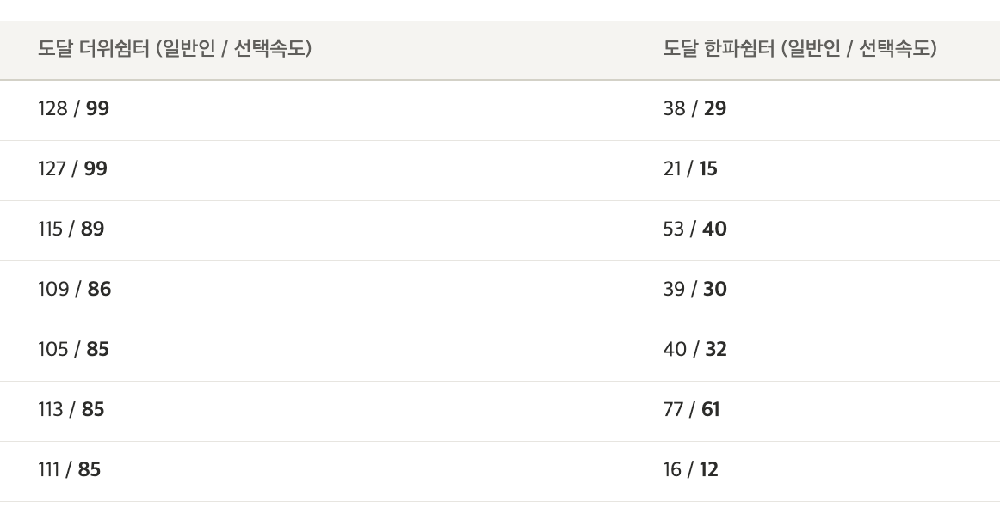
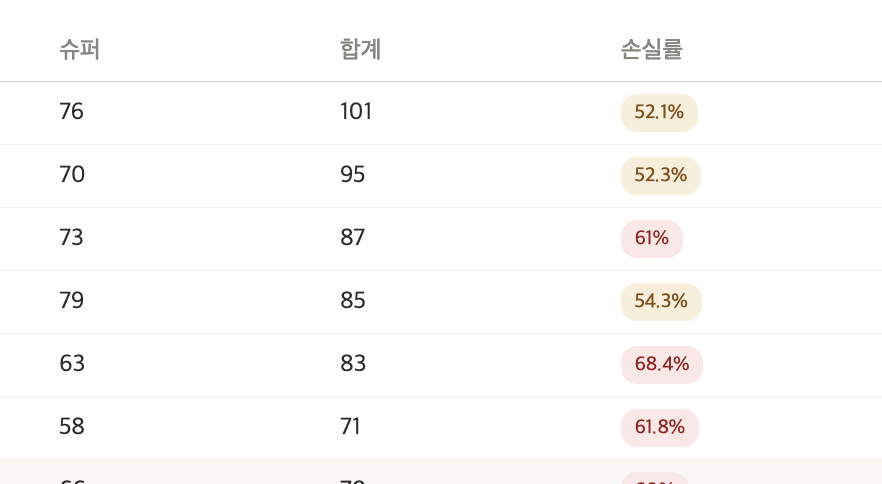
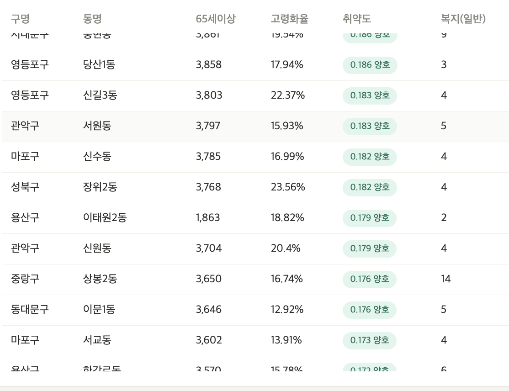
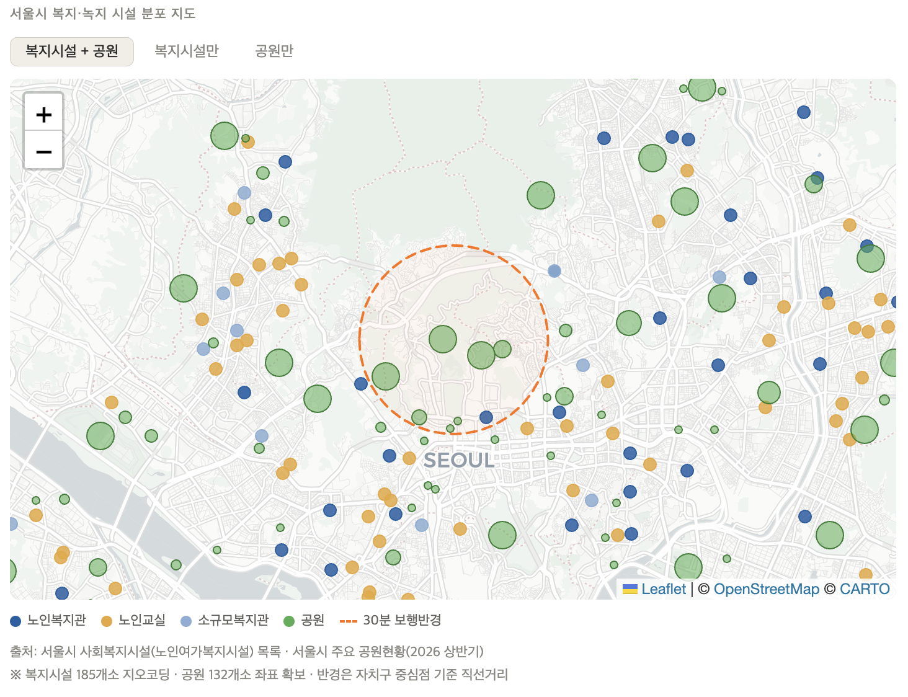
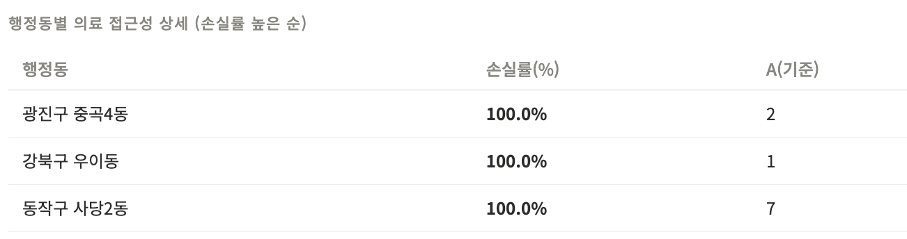

# 260503 TODO

## 1. 대시보드 공통 통합 지침

> 선요약<br>
>
> 1. 각 대시보드 손실률/점수 계산 기준을 <mark>**(선택 속도로 도달 가능한 시설 수) / (일반인 속도로 도달 가능한 시설 수) \* 100**</mark>로 바꿔주세요
> 2. 동 단위 세부 조회 -> 구 단위 집계가 원칙입니다. 아래에서 설명하는 양식대로 <mark>구 단위 집계 결과를 csv로 만들어야 합니다.</mark>
> 3. <mark>OSM 기반 보행노드 다익 방법론</mark> 사용합니다.
> 4. <mark>제가 각자 파트에 요청드린 것 이외</mark> 대시보드 세부 시각화 방식은 자율에 맡깁니다.

- 현재 각자의 대시보드를 다 읽어보니 최소한의 통일성은 필요할 것 같아서 요청드립니다. `conclusion.html`을 새로 만들어야 해서, 불가피한 수정이긴 합니다. 근데 이미 데이터 다 있어서 아마 프롬프트 한 번으로 끝나는 작업일거에요. 부담 ㄴㄴ
- 목표는 <mark>누구나 이해하기 쉬운 점수화</mark> 작업입니다. 진짜 모르는 사람이 봐도 "80점", "40점" 이래버리면 딱 머리에 와닿거든요. 앞으로 이걸 `접근가능 점수`라고 부를게요.
- 이해를 돕기 위해. <mark>30분 기준, "보행보조노인"의 "녹지" 분야 점수가 63점이 나왔다고 해봅시다. 그럼 이게 무엇을 의미할까요? 일반인이 갈 수 있는 녹지 시설 수 대비 63%만 접근 가능하다는 의미입니다. 직관적이죠? </mark>
- 점수 계산 기준 정말 쉬워요.
  - **<mark>(선택 속도로 도달 가능한 시설 수) / (일반인 속도로 도달 가능한 시설 수) \* 100</mark>**
  - 사실 제가 전에 "손실률" 기준으로 해달라 요청드렸는데, 이걸 다시 뒤집는 요구사항이라 좀 죄송스럽긴 해요. 근데 생각해보니 이 방향이 더 직관적이어서 수정 요청드립니다.. 나중에 점수 매기기가 더 쉬워서. 점수는 당연히 높아야 좋은거니까..
    - 손실률 기준으로 가버리면 <mark>손실률이 낮을 수록 우수하다</mark> 가 결론이 되어야 하는데 이게 이 시각화 자료를 처음 보는 사람 입장에서는 다소 비직관적으로 여겨질 수 있을 것 같아 내린 결정입니다.
  - 당연히 대시보드 토글에서 "일반인" 선택해버리면 점수는 100점이 나올테니, 이때는 대시보드에서 점수 안보이게끔 하면 될거같고.
  - 노인 / 보행보조 / 보행보조 하위 15% 기준 점수가 나오겠죠?

### 각자 대시보드 검토 및 개선점 제안

#### 김성령



- 분모 분자 순서를 바꿔야겠습니다. 거기에 100 곱해줘서 백분율화해야 하고.
- 제 수정사항은 제가 열심히 잘 해보겠습니다.. 고칠게 많네요

#### 심재현



- 이미 손실률이 계산되어 있네요. 이 경우 `1 - 손실율` 하면 `일반인 도달 노드 수 대비 노인(선택한 속도) 도달 노드 수`가 바로 나오니, 그냥 1에서 손실율 빼주고, 100 곱해주면 접근가능 점수가 나오겠네요.
- 다만, 이 손실률 -> 점수 변환 때 수정해주셔야 할게 하나 있습니다. OSM 기반으로 바꿔주셔야 할 것 같아요. 관련 문서 `260503_infra_OSM전환_설계.md`로 제가 함 뽑아봤는데, 직접 작업할 때 도움이 되었으면 좋겠네요.
- 사실 재현님 대시보드에서 가장 인상적인 부분이 "보행 반경 모식도" 부분이었어서, 이 부분 꼭 살리는 방향으로 프롬프팅해서 작성된 문서에요. 다만 제가 직접 뽑아본게 아니라 결과물이 어떻게 나올지는 잘 모르겠습니다.
- 만약 시각화 결과가 너무 안좋게 나와버리면 현재 시각화 자료는 유지하되, 손실률 -> 점수 계산 시에만 OSM 기반으로 수정해주세요.


- 세밀 조정 슬라이더가 실제 인터렉티브하게 작용하는 곳이 "보행 반경 모식도"인 것 같습니다. 그거 외에 실제 수치에는 영향을 미치지 않는 것 같은데 맞을까요? 만약 그렇다면, 네 가지 수치 이외의 중간 수치가 크게 의미를 갖지 못할 것 같습니다.
- 물론, "본론 대시보드"에서 국한된 이야기입니다. "서론 대시보드"에는 저희 속도 4가지 기준을 제시하기 이전이므로 저런 슬라이더가 충분히 파워풀한 가치를 갖는다고 생각해요.

#### 양석준



- `취약도`라는 자체 파라미터를 잘 뽑아주셨습니다.
- 특히 "도달 가능 노드 수"가 아니라, "도달하지 못하는 노인의 수"로 뒤집어 생각한게 진짜 인상 깊은 포인트네요
- `conclusion.html` 에 종합적으로 데이터를 합치려면 스케일 통합이 필요해서, 위에 언급한 접근가능 점수로 다시 계산해주시면 감사하겠습니다.
  
- 현재 시설 분포 지도에서의 보행 반경이 "구" 단위로만 조회되는 것 같은데 아래 접근성 상세 표를 보면 "동" 단위도 지원하는 것 같습니다. 지도에서도 "동" 단위 분포 지도를 지원하면 괜찮지 않을까 하는 생각입니다.

#### 이정태



- 이미 손실율 계산이 잘 되어 있습니다.
- 재현님 파트랑 동일합니다. `1 - 손실율` 로 점수 변환만 부탁드립니다.
- 아 그리고, <mark>경사 보정 때 사용된 상수가 있을 것 같은데, 이거 저한테 정리해서 주셔야 해요. 밑에서 자세히 설명드릴게요. </mark>


- 기준(A) - 비교(B) 방식으로 구현해 주셨습니다. 저희 시각화 자료 목적 자체가 일반인 vs (노인 기준)이라, 기준 A를 선택 가능하게 할 필요까지는 없다고 생각해요.
- 현재 "손실률 지도"를 제공하고 있는데, "접근가능 점수" 기준으로 바꾼다면 해당 지도 역시 수정이 필요할 것 같습니다. 다른 파트처럼 접근가능 지점을 표시해도 되고, 아니면 점수 `= (1 - 손실율)`을 시각화해도 좋고요.

## 2. conclusion.html 데이터 요청

- 일단 `conclusion.html`이란? 우리가 5개 파트별 대시보드를 만들었죠? 이걸 다 섞어먹는 결론 대시보드입니다.
- 우선 `conclusion.html`을 열어봅시다.
- 대충 제가 뭘 하고싶은지 알겠죠? 5개 섹션의 "종합" 대시보드를 만드는게 목표에요.
- 이걸 구현하기 위한 각자의 csv 파일이 필요합니다. 사실 별거 아니긴 함

### 공통 제출 항목

-

- 그냥 섞으면 재미 없으니, 여기에 정태형이 한 <mark>경사로 보정</mark>이랑 제가 한 <mark>빙결 취약 구역</mark>을 얹어볼거에요. 대시보드 시간 선택 하단에 "환경 보정" 체크박스가 있고, 이거 체크하면 <mark>경사가 심한 구에는 도달 가능 노드 수에 페널티를 주는. </mark>
- 처음엔 단순히 상수화해서 곱하고 끝낼라했는데, 이럼 "구"라는 단위 기준 너무 분석적이지 못한 것 같아서, 여러 가지 방법론을 생각해봤어요. 읽어보고 괜찮아보이는 방식 말해주세요.
  1. 위에서 언급한 "단순 추가 손실률 곱해버리기"

  2.

- `conclusion.html` 종합 대시보드 (결론 대시보드) 완성을 위해 필요해요. 아래 보고 클로드한테 던져주면 알아서 잘 계산하긴 할듯
- 사실 이미 다 계산되어있긴 할거에요 각각 파트별 대시보드 만들었으면 제가 아마 260425 지시서에 이 공식대로 해달라고 써놨으니까.. 이미 되어있긴 할듯?

---

## 팀원 공통 제출 항목

**파일명:** `loss_[이름이니셜].csv` 예) `loss_KSL.csv`

```csv
구명, 일반인_도달수_30min, 손실률_노인_30min, 손실률_보행보조_30min, 손실률_하위15%_30min
강남구, 42, 12.4, 22.8, 33.5
강북구, 18, 31.2, 48.6, 61.3
...
```

| 컬럼                    | 설명                                                                      |
| ----------------------- | ------------------------------------------------------------------------- |
| `일반인_도달수_30min`   | 일반인(1.28 m/s) 30분 기준, 구 내 해당 분야 시설 도달 POI 수 또는 노드 수 |
| `손실률_노인_30min`     | 일반 노인(1.12 m/s) 30분 손실률                                           |
| `손실률_보행보조_30min` | 보행보조 노인(0.88 m/s) 30분 손실률                                       |
| `손실률_하위15%_30min`  | 보행보조 하위 15%(0.70 m/s) 30분 손실률                                   |

---

## 분야별 담당 + 도달 대상 시설

| 담당   | 분야         | 도달 대상 시설                        |
| ------ | ------------ | ------------------------------------- |
| 유호준 | D1 교통      | 저상버스 정류장 + 지하철 엘리베이터   |
| 심재현 | D2 인프라    | 전통시장 + 슈퍼마켓 + 은행 + 주민센터 |
| 이정태 | D3 의료      | 1차 의료기관 + 약국 + 보건소          |
| 양석준 | D4 복지·녹지 | 경로당 + 노인복지관 + 공원            |
| 김성령 | D5 기후      | 무더위쉼터 + 한파쉼터                 |

---

## 환경 보정 계수 — 추가 제출 항목

코로플레스 위의 "경사도 보정 / 빙결 취약 보정" 토글 기능에 사용.

### 이정태 — 경사 계수

```csv
구명, 경사_계수
강남구, 0.10
강북구, 0.78
...
```

- 구별 평균 경사도를 **0~1로 min-max 정규화**
- SRTM DEM 또는 OSM elevation edge 기반 분석 결과에서 구별 집계

### 김성령 — 빙결 계수

```csv
구명, 빙결_계수
강남구, 0.20
강북구, 0.72
...
```

- 구별 동절기 결빙 취약도를 **0~1로 정규화**
- 기존 결빙 취약 지점 분석 결과에서 구별 집계

---

## 주의사항

- 기준 시간은 **30분 고정**. 15분/45분은 보간 처리 예정.
- 구 단위 집계: 행정동 단위 분석 결과를 구 단위로 aggregation
- 손실률 공식 통일: `(1 − 해당속도_도달수 / 일반인_도달수) × 100`

---

## 3. 이정태 — Tobler Ratio CSV 추가 요청

`04_slope_correction.py`에서 이미 계산된 `tobler_ratio`를 행정동 단위로 추출하여 제출해 주세요.

**파일명:** `tobler_ratio_LEE.csv`

```csv
dong_code, full_name, tobler_ratio
11110101, 종로1·2·3·4가동, 0.91
11110530, 청운효자동, 0.83
...
```

- `tobler_ratio` = `V(slope_est) / V(0)` (0 < ratio ≤ 1, 평지=1에 가까움, 가파를수록 작아짐)
- 426개 행정동 전체 (이미 `gdf_dong["tobler_ratio"]`로 계산되어 있음)
- 구 단위 집계는 `conclusion.html`에서 처리 예정

**사용 방식 (다른 팀 공통):**

OSM 다익스트라 기반이므로 반경이 아닌 **속도**에 적용:

```python
speed_경사적용 = base_speed * tobler_ratio[동]
# edge_weight = edge_length / speed_경사적용
# → 30분 예산 내 도달 가능 노드 수 재계산
```

- 비율은 분야와 무관하게 동일하게 적용 (경사는 보행자 속도에 영향, 목적지 종류와 무관)
- 각 팀이 자기 분야 분석 시 이 ratio를 속도에 곱해 Dijkstra 재실행하면 됨
