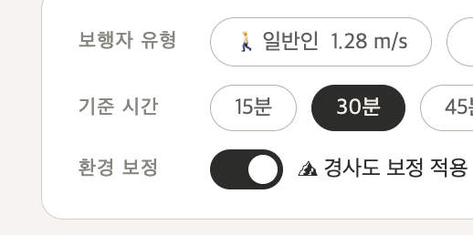
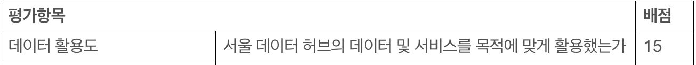

# 260503 TODO

> 선요약<br>
>
> 1. 각 대시보드 손실률/점수 계산 기준을 <mark>**(선택 속도로 도달 가능한 시설 수) / (일반인 속도로 도달 가능한 시설 수) \* 100**</mark>로 바꿔주세요
> 2. tobler_ratio_LEE.csv 파일을 참고해서 "경사로 보정" 여부에 따른 osm dijkstra를 추가해주세요.
> 3. 동 단위 세부 조회 -> 구 단위 집계가 원칙입니다. 아래에서 설명하는 양식대로 <mark>구 단위 집계 결과를 csv로 만들어야 합니다.</mark>
> 4. <mark>OSM 기반 보행노드 다익 방법론</mark> 사용합니다.
> 5. <mark>제가 각자 파트에 요청드린 것 이외</mark> 대시보드 세부 시각화 방식은 자율에 맡깁니다.
> 6. 맨 아래. <mark>제출물 진짜 마지막 정리</mark> 보고 각자 할 일 해주세요.

## conclusion.html

- 일단 `conclusion.html`이란? 우리가 5개 파트별 대시보드를 만들었죠? 이걸 다 섞어먹는 결론 대시보드입니다.
- 우선 `conclusion.html`을 열어봅시다.
- 대충 제가 뭘 하고싶은지 알겠죠? 5개 섹션의 "종합" 대시보드를 만드는게 목표에요.
- 이걸 구현하기 위한 각자의 csv 파일이 필요합니다. 사실 별거 아니긴 함. 아래에 설명 자세히 했음.

## 1. 대시보드 손실률 -> 도달가능점수 변환

- 현재 각자의 대시보드를 다 읽어보니 최소한의 통일성은 필요할 것 같아서 요청드립니다. `conclusion.html`을 새로 만들어야 해서, 불가피한 수정이긴 합니다. 근데 이미 데이터 다 있어서 아마 프롬프트 한 번으로 끝나는 작업일거에요. 부담 ㄴㄴ
- 목표는 <mark>누구나 이해하기 쉬운 점수화</mark> 작업입니다. 진짜 모르는 사람이 봐도 "80점", "40점" 이래버리면 딱 머리에 와닿거든요. 앞으로 이걸 `도달가능 점수`라고 부를게요.
- 이해를 돕기 위해. <mark>30분 기준, "보행보조노인"의 "녹지" 분야 점수가 63점이 나왔다고 해봅시다. 그럼 이게 무엇을 의미할까요? 일반인이 갈 수 있는 녹지 시설 수 대비 63%만 접근 가능하다는 의미입니다. 직관적이죠? </mark>
- 점수 계산 기준 정말 쉬워요.
  - **<mark>(선택 속도로 도달 가능한 시설 수) / (일반인 속도로 도달 가능한 시설 수) \* 100</mark>**
  - 사실 제가 전에 "손실률" 기준으로 해달라 요청드렸는데, 이걸 다시 뒤집는 요구사항이라 좀 죄송스럽긴 해요. 근데 생각해보니 이 방향이 더 직관적이어서 수정 요청드립니다.. 나중에 점수 매기기가 더 쉬워서. 점수는 당연히 높아야 좋은거니까..
    - 손실률 기준으로 가버리면 <mark>손실률이 낮을 수록 우수하다</mark> 가 결론이 되어야 하는데 이게 이 시각화 자료를 처음 보는 사람 입장에서는 다소 비직관적으로 여겨질 수 있을 것 같아 내린 결정입니다.
  - 당연히 대시보드 토글에서 "일반인" 선택해버리면 점수는 100점이 나올테니, 이때는 대시보드에서 점수 안보이게끔 하면 될거같고.
  - 노인 / 보행보조 / 보행보조 하위 15% 기준 점수가 나오겠죠?

## 2. 경사로 보정 적용

- 이거도 쉬워요. 정태형이 뽑아준 `tobler_ratio_LEE.csv` 파일의 상수를 선택한 속도 기준에 곱한 다음 다익스트라 돌리면 돼요.
- 자 이게 뭐냐, 간략하게 설명을 드릴게요
  - https://en.wikipedia.org/wiki/Tobler%27s_hiking_function
  - 이런게 있어요. 경사도에 따른 속도 차이.
  - 구 / 동 별 경사도 기반 속도 변화율 델타값이 tobler_ratio_LEE.csv에 정리되어 있고요.
  - 이걸 그냥 우리가 다익스트라 돌릴 속도에 곱해주기만 하면 됩니다.
  - <mark>>현재 우리가 정한 속도 기준 있죠. 일반인/노인/보행보조/하위15. 걍 이 속도값에 곱하기만 하면 됩니다.</mark>
    - 예시: 행정구역 종로구 사직동. 델타값(tobler_ratio) 0.687. 보행보조 기준 속도 0.88. 경사도 적용 시 -> 0.687 \* 0.88 m/s로 변환됨.

## 3. 구 단위 집계 csv 제출

- 기준 시간: 30분 고정
- <mark>접근가능점수 = (해당속도 도달 노드 수 / 일반인 도달 노드 수) × 100</mark>
- "구 단위"로 집계해주세요. conclusion.html에는 "구" 단위만 할 예정
- <mark>분야 별로 노드 유형이 세분화되어있지 않나요? -> 걍 다 더하죠. 제 파트 예시로 들면 (더위쉼터) + (한파쉼터) 그냥 다 더해버리기. 결론 낼라면 이게 맞다고 생각해요. </mark>

```csv
구명, 점수_노인_경사X, 점수_노인_경사O, 점수_보행보조_경사X, 점수_보행보조_경사O, 점수_하위15_경사X, 점수_하위15_경사O
강남구, 91.2, 88.0, 78.4, 74.1, 65.3, 61.5
강북구, 72.1, 64.3, 58.8, 50.2, 44.1, 37.6
...
```

- <mark>일반인 기준이 없는 이유? 위에 내용을 잘 안읽으셨군요..</mark>
- <mark>접근가능점수 계산 시 분모가 일반인 기준이므로 일반인 점수는 항상 100점입니다.</mark>

| 컬럼                  | 설명                                                     |
| --------------------- | -------------------------------------------------------- |
| `점수_노인_경사X`     | 일반 노인(1.12 m/s) 접근가능점수, 평지 기준              |
| `점수_노인_경사O`     | 일반 노인(1.12 m/s) 접근가능점수, 경사 보정 적용         |
| `점수_보행보조_경사X` | 보행보조(0.88 m/s) 접근가능점수, 평지 기준               |
| `점수_보행보조_경사O` | 보행보조(0.88 m/s) 접근가능점수, 경사 보정 적용          |
| `점수_하위15_경사X`   | 보행보조 하위 15%(0.70 m/s) 접근가능점수, 평지 기준      |
| `점수_하위15_경사O`   | 보행보조 하위 15%(0.70 m/s) 접근가능점수, 경사 보정 적용 |

### 각자 대시보드 검토 및 개선점 제안

#### 김성령


- 분모 분자 순서를 바꿔야겠습니다. 거기에 100 곱해줘서 백분율화해야 하고.
- 제 수정사항은 제가 열심히 잘 해보겠습니다.. 고칠게 많네요

#### 심재현


- 이미 손실률이 계산되어 있네요. 이 경우 `1 - 손실율` 하면 `일반인 도달 노드 수 대비 노인(선택한 속도) 도달 노드 수`가 바로 나오니, 그냥 1에서 손실율 빼주고, 100 곱해주면 도달가능 점수가 나오겠네요.
- 다만, 이 손실률 -> 점수 변환 때 수정해주셔야 할게 하나 있습니다. OSM 기반으로 바꿔주셔야 할 것 같아요. 관련 문서 `260503_infra_OSM전환_설계.md`로 제가 함 뽑아봤는데, 직접 작업할 때 도움이 되었으면 좋겠네요.
- 사실 대재현 대시보드에서 가장 인상적인 부분이 "보행 반경 모식도" 부분이었어서, 이 부분 꼭 살리는 방향으로 프롬프팅해서 작성된 문서에요. 다만 제가 직접 뽑아본게 아니라 결과물이 어떻게 나올지는 잘 모르겠습니다.
- 만약 시각화 결과가 너무 안좋게 나와버리면 현재 시각화 자료는 유지하되, 손실률 -> 점수 계산 시에만 OSM 기반으로 수정해주세요.


- 세밀 조정 슬라이더가 실제 인터렉티브하게 작용하는 곳이 "보행 반경 모식도"인 것 같습니다. 그거 외에 실제 수치에는 영향을 미치지 않는 것 같은데 맞을까요? 만약 그렇다면, 네 가지 수치 이외의 중간 수치가 크게 의미를 갖지 못할 것 같습니다.
- 물론, "본론 대시보드"에서 국한된 이야기입니다. "서론 대시보드"에는 저희 속도 4가지 기준을 제시하기 이전이므로 저런 슬라이더가 충분히 파워풀한 가치를 갖는다고 생각해요.

#### 양석준


- `취약도`라는 자체 파라미터를 잘 뽑아주셨습니다.
- 특히 "도달 가능 노드 수"가 아니라, "도달하지 못하는 노인의 수"로 뒤집어 생각한게 진짜 인상 깊은 포인트네요
- `conclusion.html` 에 종합적으로 데이터를 합치려면 스케일 통합이 필요해서, 위에 언급한 도달가능 점수로 다시 계산해주시면 감사하겠습니다.
  
- 현재 시설 분포 지도에서의 보행 반경이 "구" 단위로만 조회되는 것 같은데 아래 접근성 상세 표를 보면 "동" 단위도 지원하는 것 같습니다. 지도에서도 "동" 단위 분포 지도를 지원하면 괜찮지 않을까 하는 생각입니다.

#### 이정태


- 이미 손실율 계산이 잘 되어 있습니다.
- 재현누나 파트랑 동일합니다. `1 - 손실율` 로 점수 변환만 부탁드립니다.
- 아 그리고, <mark>경사 보정 때 사용된 상수가 있을 것 같은데, 이거 저한테 정리해서 주셔야 해요. 밑에서 자세히 설명드릴게요. </mark>


- 기준(A) - 비교(B) 방식으로 구현해 주셨습니다. 저희 시각화 자료 목적 자체가 일반인 vs (노인 기준)이라, 기준 A를 선택 가능하게 할 필요까지는 없다고 생각해요.
- 현재 "손실률 지도"를 제공하고 있는데, "도달가능 점수" 기준으로 바꾼다면 해당 지도 역시 수정이 필요할 것 같습니다. 다른 파트처럼 도달가능 지점을 표시해도 되고, 아니면 점수 `= (1 - 손실율)`을 시각화해도 좋고요.

---

## 주의사항

### 1. 행안부 <-> 국가데이터처 동 분류 코드 다름

- 경사로의 동 분류 코드는 "국가데이터처" 표준 분류표입니다
- "행안부" 분류 동 코드와 체계가 달라요 저 이거때매 꽤 고생했음
- 이거 변환해주는 엑셀 문서 docs/1-3 행정안전부 코드와 국가데이터처~ 첨부드렸으니 혹시 조인 이슈 나면 이거 활용 ㄱㄱ

# 제출물 진짜 마지막 정리 (~5/6 수요일 23:59)

- 요약의 요약입니다.

## 1. 위에 장황하게 적은 대시보드 "공통 수정 사항"

- 손실률 -> `도달가능 점수`로 변환
- 경사로 보정 osm 다익 추가. 토글 버튼 형식으로.
- 
- 제가 위에 적어드린 것 참고해서 대시보드 각자 수정
- conclusion.html용 csv 제출

## 2. 자신의 산출물 정리 자료

- 활용 데이터셋 종류
- 데이터셋 전처리, 이 데이터셋을 활용해 어떤 시각화를 뽑아냈는지
- 사용한 분석 / 시각화 기법 정리
- 각 시각화 산출물이 어떤 의미가 있는지, 어떤 인사이트를 제공하는지.
- 서울 데이터 허브 서비스 활용 내역을 반드시 포함시켜주세요.
  - 무슨 데이터를 썼는지, 어떻게 썼는지.
  - 아래 사진 보면 반드시 포함해야 한다는 것을 알 수 있어요.
  - 실제 시각화 수상작들 봐도 발표자료에도 박아놓을 정도로 비중있게 쓰더라고요.
    
    

## 3. introduce.html / conclusion.html 뽑아오기

- 김성령, 심재현 - introduce.html
- 양석준, 이정태 - conclusion.html

- 참고 파일은 각각 final_output/KIM 아래 introduce_kim, conclusion_kim에 뽑았어요. 말 그대로 참고. 각자 뽑아서 이쁜거 보팅해서 쓸게요.
